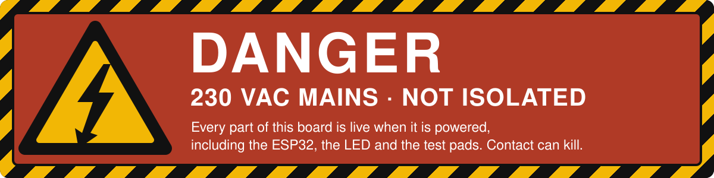
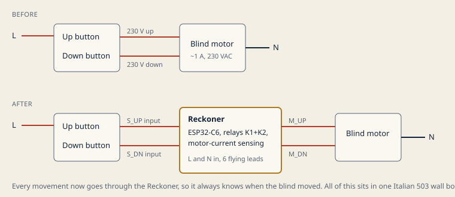
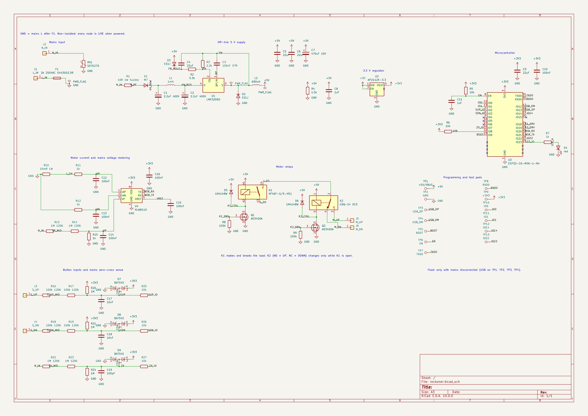
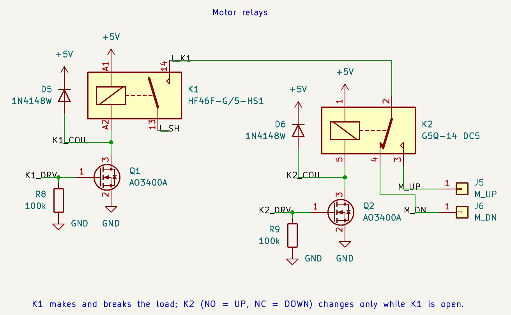
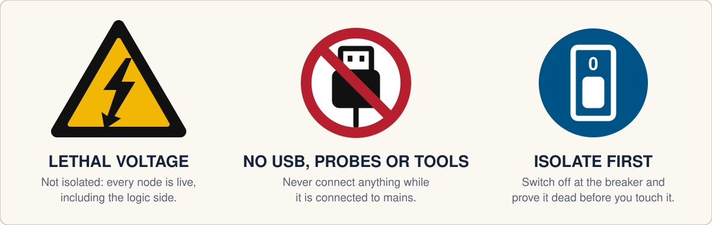

<p align="center">
  <picture>
    <source media="(prefers-color-scheme: dark)" srcset="brand/logos/lockup-reversed.svg">
    
  </picture>
</p>

<p align="center">
  <strong>Turns press-and-hold motorised blinds into Home Assistant covers.</strong><br>
  One Reckoner per blind, hidden in the wall box behind the buttons you already have.
</p>

<p align="center">
  
  
  
  
</p>

<p align="center">
  
  
  
  
  
  <a href="https://kicanvas.org/?github=https%3A%2F%2Fgithub.com%2Fblind-reckoning%2FReckoner%2Fblob%2Fmaster%2FPCB%2Freckoner.kicad_sch"></a>
  <a href="LICENSE"></a>
  <a href="LICENSE-DOCS"></a>
</p>

<p align="center">
  
</p>

> [!CAUTION]
> **This project switches 230 VAC mains, and its electronics are not isolated from the mains.** There is no transformer: every part of the board, including the microcontroller, the LED and the programming pads, sits at mains voltage whenever it is connected.
>
> A mistake while building, testing, flashing or installing it can **kill you** or **start a fire inside your wall**. Read the whole [Safety](#safety) section before you build, power or install anything.
>
> **If you are not qualified to work on mains wiring, do not build or install this.** Read it, learn from it, but leave the wall to an electrician.

## What it does

Motorised blinds with press-and-hold buttons have no idea where they are. The Reckoner sits in the wall box between those buttons and the blind motor, and adds what the buttons can't.

- **Keeps your buttons working, with or without Wi-Fi.** One press runs the blind all the way up or down. Another press while it is moving stops it.
- **For Home Assistant.** The blind appears as a cover: open, close, stop, set position and report position.
- **Always knows where the blind is.** There is no position sensor. It works the position out by **dead reckoning**, the way navigators did before GPS: from a known starting point, the calibrated time for a full stroke and the time elapsed.
- **Takes a fix at every end.** When the blind reaches fully open or fully closed, the motor's own limit switch cuts its current. The Reckoner sees that drop and takes a **fix** (position confirmed), which clears any **drift** (timing error built up since the last fix).
- **Keeps its position through power cuts.** It notices mains loss within one cycle and saves the position on the energy left in its capacitors.
- **Fits behind the switches.** The target is a 60 × 40 mm board inside an Italian 503 wall box.

Positions are whole percent: 0% is closed and 100% is open, matching Home Assistant.

## How it works

<p align="center">
  
</p>

Every movement now goes through the Reckoner, so the blind can't move without it knowing.

| Block | Main parts | What it does |
|---|---|---|
| Mains input | 2 A slow-blow fuse, 275 VAC varistor | Protects the board and the wall wiring; circuit ground is mains L after the fuse |
| Off-line 5 V supply | LNK3206D high-side buck | Makes 5 V straight from the mains, with no transformer, and keeps running for at least 100 ms after a power cut |
| 3.3 V regulator | AP2112K-3.3 | Clean 3.3 V for the radio and the metering chip |
| Microcontroller | ESP32-C6-MINI-1 | Wi-Fi 6, Bluetooth LE and Thread; runs the dead-reckoning logic |
| Metering | HLW8110, 10 mΩ shunt | Measures motor current (to detect the ends) and mains voltage |
| Motor relays | HF46F-G on/off, G5Q-14 changeover | Switches the motor, interlocked in hardware |
| Button and mains sense | resistor dividers, BAT54S clamps | Reads the wall buttons and every mains cycle, without optocouplers |
| Programming pads | 13 test pads | First flash only, with mains disconnected; updates after that go over the air |

<p align="center">
  
</p>

### The interlock

<p align="center">
  
</p>

K1 is the only relay that switches the motor on and off. K2 only chooses the direction, and its common contact is fed **through** K1. A changeover contact can only ever touch one side, so **up and down can never be live at the same time**: not with a firmware bug, not with a crash, not even with a welded contact.

| K1 | K2 | Motor |
|---|---|---|
| off | either | stopped |
| on | off | down |
| on | on | up |

The firmware sets K2 first and then closes K1, and opens K1 before releasing K2, so K2 never switches under load. Both relay drivers are held off by hardware through reset, boot, crashes and flashing.

## Safety

<p align="center">
  
</p>

### Why this board is more dangerous than most

> [!WARNING]
> **There is no low-voltage side.** Circuit ground is **mains live (L)**. The ESP32, its antenna, the LED, the MOSFETs, the test pads and every copper trace sit at 230 VAC relative to earth whenever L and N are connected. There is no protective earth connection, so all protection from shock comes from the enclosure.

- **"Off" is not safe.** The board is powered as long as L and N are connected. A blind that is stopped, relays that are open or a "power off" in an app change nothing. Only isolating the circuit at the breaker does.
- **The motor wires are dangerous even when idle.** J5 and J6 connect to neutral through the motor windings when the relays are open. While the motor runs, its run capacitor puts about **460 VAC** between the up and down wires.
- **It can stay charged after you unplug it.** The two 400 V capacitors (C1 and C2) can hold a dangerous charge after mains is removed. Measure across them before you touch a board that has been powered.

### Never

> [!CAUTION]
> - **Never connect a USB cable, USB-serial adapter, debugger or laptop while the board is connected to mains.** A computer's USB ground is usually tied to earth through its charger. Joining it to this board's ground, which is mains L, shorts L to earth through your cable and your computer, and can make the computer's metal parts live.
> - **Never use a grounded oscilloscope probe or a mains-powered instrument on a live board.** Same reason, same result.
> - **Never touch the board while it is connected to mains**, not even "just the logic side". There is no logic side. There is only the death side!
> - **Never power it without an insulating enclosure**, and never mount it in a metal box or anywhere it can touch other conductors.
> - **Never work on live mains alone.** Always have a person capable, trained and willing of providing first aid.

### Before you install

1. **Get a qualified electrician.** In many countries, Italy included, work on fixed household wiring must be done by a qualified installer. An uncertified device in your wiring may also affect your home insurance. Check your local rules.
2. **Isolate and prove dead.** Switch off the circuit at the breaker, lock it off, and check with a voltage tester that you have just checked on a known live source. Check the tester again afterwards.
3. **Check the upstream protection.** The circuit must have a breaker of 16 A or less (with at least 6 kA breaking capacity) and a 30 mA RCD. The board's fuse handles overloads only: with its 50 A breaking capacity it relies on the house breaker to clear a direct short.
4. **Wire it exactly as labelled.**
   - J1 goes to live (L) and J2 to neutral (N). Swapping them is not supported.
   - The wall buttons' common must be on the **same L conductor** as J1.
   - J3 and J4 go to the up and down button outputs, and J5 and J6 to the motor's up and down wires.
   - The motor's neutral stays on house N in the box; it never goes to the board.
5. **Use the right materials.** The leads are 0.75 mm² H05V-K wire rated 450/750 V. Join them with lever connectors rated for the circuit, and keep the insulated board clear of the other cables in the box.
6. **Check the motor.** It must be a 230 VAC capacitor-run tubular motor of about 1 A, with two direction wires and **its own end-of-travel limit switches**. The Reckoner relies on those switches to stop at the ends. Don't connect anything larger: the direction relay is rated 3 A at 250 VAC.

### Flashing and bench testing

- **Flash only with mains disconnected at the source**, never just switched off at the wall. The first flash uses the USB pads TP1 to TP4. Short TP5 (BOOT) to GND during reset to enter download mode. After that, updates go over the air. The first-flash procedure hasn't been tried on hardware yet.
- **Live testing belongs on an isolated bench:**
  - power it through an isolation transformer;
  - use a current-limited supply, such as a series-lamp limiter, for the first power-up;
  - keep a clear shield in front of the board and your hands away from it;
  - measure only with isolated or differential probes.
- **An isolation transformer doesn't make the board safe to touch.** It only removes the earth reference.

### What the board does to protect you, and what it doesn't

| It does | It doesn't |
|---|---|
| A 2 A slow-blow fuse on L, a 10 Ω fusible resistor in front of the supply and a 275 VAC varistor against surges | Isolate anything: there is no transformer, no earth and no touch protection on the board |
| Have a hardware interlock: up and down can never both be live | Clear a direct short by itself: that is the house breaker's job |
| Have relays that default to off through reset, boot, crashes and flashing | Make "off" safe: the board is live while L and N are connected |
| Have button inputs that tolerate a common wired to N (at most 1.6 mA flows, and the firmware can flag it) | Replace an enclosure, an RCD or a qualified installer |
| Have a planned layout with at least 3 mm creepage between mains nodes, and 5 mm or a slot between the motor wires | Carry any certification: no CE marking, no UL listing, no lab testing |

### Disclaimer

> [!IMPORTANT]
> Blind Reckoning is a hobby prototype, built for Hack Club Half Life. It is **not a certified product** and has **not been tested by any laboratory**. Everything in this repository is provided as is, without warranty of any kind.
>
> **If you build, flash, test or install a Reckoner, you do so entirely at your own risk.** The authors accept no responsibility for injury, death, fire or damage to property caused by using anything in this repository.

## Project status

| Stage | State |
|---|---|
| Requirements and architecture | done |
| Parts list (`bom.csv`, JLCPCB/LCSC parts) | done |
| Schematic: 86 parts, 51 nets, 0 ERC errors | done |
| PCB layout | next |
| Enclosure | not started |
| Firmware | not started |

## Repository

```
PCB/            KiCad 10 project: schematic and the custom HLW8110 symbol
CAD/            enclosure and 3D assembly (to come)
Firmware/       firmware (to come)
brand/          logos, colours and fonts
docs/images/    images used in this README
bom.csv         bill of materials with LCSC part numbers, ready for JLCPCB assembly
LICENSE         hardware licence: CERN-OHL-S-2.0
LICENSE-DOCS    documentation licence: CC BY-SA 4.0
```

## Licence

Blind Reckoning is open hardware. You may study, build, modify, share and sell it under these terms:

| What | Licence | Full text |
|---|---|---|
| **Hardware:** everything in `PCB/` and `CAD/`, and `bom.csv` | CERN Open Hardware Licence version 2, strongly reciprocal (**CERN-OHL-S-2.0**) | [`LICENSE`](LICENSE) |
| **Documentation:** this README and everything in `docs/` | Creative Commons Attribution-ShareAlike 4.0 International (**CC BY-SA 4.0**) | [`LICENSE-DOCS`](LICENSE-DOCS) |
| **Firmware** | Not written yet; its licence will be chosen when it is. | |

**These licences apply retroactively.** They cover every version of this repository, including all commits made before the licence files were added on 2 October 2026. Any copy of the hardware or documentation you obtained from this repository, from any commit, is licensed under the terms above as if the licence files had been there from the first commit.

**Strongly reciprocal** means that if you share a modified Reckoner design, or make and sell boards based on one, you must publish your modified design under the same licence. For a mains device, this keeps every change, including the safety-relevant ones, open to review.

Hardware notice:

```
Copyright 2026 KOZELJ Michele

This source describes Open Hardware and is licensed under the CERN-OHL-S v2.

You may redistribute and modify this source and make products using it under
the terms of the CERN-OHL-S v2 (https://ohwr.org/cern_ohl_s_v2.txt).

This source is distributed WITHOUT ANY EXPRESS OR IMPLIED WARRANTY, INCLUDING
OF MERCHANTABILITY, SATISFACTORY QUALITY AND FITNESS FOR A PARTICULAR PURPOSE.
Please see the CERN-OHL-S v2 for applicable conditions.

Source location: https://github.com/blind-reckoning/Reckoner

As per CERN-OHL-S v2 section 4, should You produce hardware based on this
source, You must where practicable maintain the Source Location visible on
the circuit board or enclosure of the Reckoner or other products you make
using this source.
```

Not covered by these licences:

- **The Blind Reckoning name and logos** (`brand/logos/`, `brand/symbols/`) are not licensed for reuse. Modified or cloned hardware must use its own name and mark. You may say it is "for Blind Reckoning" or "compatible with Blind Reckoning" (see the [brand book](brand/README.md)).
- **The fonts** in `brand/fonts/` (IBM Plex Sans, IBM Plex Mono, Young Serif) belong to their authors and are distributed under the SIL Open Font License 1.1. Their licence files are next to them.
- **KiCad library symbols and footprints** used in the design are under KiCad's library licence (CC BY-SA 4.0 with an exception for designs that use them), so they don't change the licence of the Reckoner design.

## Built for

[Hack Club Half Life](https://halflife.hackclub.com), 2026.
